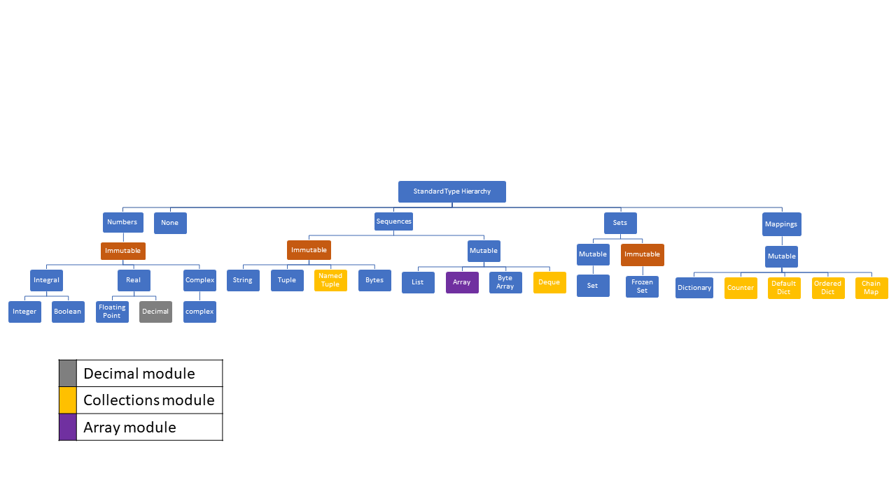

# [Python](https://www.python.org/ftp/python/doc/quick-ref.1.3.html)
 Python is an interpreted, object-oriented, high-level programming language with dynamic semantics. Its high-level built in data structures, combined with dynamic typing and dynamic binding, make it very attractive. [Source](https://www.python.org/doc/essays/blurb/)
 
 Python's run time must work harder than Java's. For example, when evaluating the expression a+b, it must first inspect the objects a and b to find out their type, which is not known at compile time. It then invokes the appropriate addition operation, which may be an overloaded user-defined method. Java, on the other hand, can perform an efficient integer or floating point addition, but requires variable declarations for a and b, and does not allow overloading of the + operator for instances of user-defined classes. [Source](https://www.python.org/doc/essays/comparisons/)
 
 https://hackernoon.com/why-is-python-so-slow-e5074b6fe55b

## Python Features

### Variable Names


[Diff between underscore and dundar variable](https://www.youtube.com/watch?v=ALZmCy2u0jQ)

A single underscore in front of a variable name (prefix) is a hint that a variable is meant for internal use only. 

A double underscore prefix causes the Python interpreter to rewrite the variable name in order to avoid naming conflicts in subclasses. Double underscores are also called "dunders" in Python.

### Data Types



Broad categorization of Python Datatypes

Python can be broadly divided in following categories as per [Python Datamodel](https://docs.python.org/reference/datamodel.html)

1. Number Types
- int– int stands for integer. This Python Data Type holds signed integers.An integer can be of any length, with the only limitation being the available memory.
- ye
- float– These represent machine-level double precision floating point numbers. You are at the mercy of the underlying machine architecture (and C or Java implementation) for the accepted range and handling of overflow. 
- Decimal : te
- complex- This Python Data Types holds a complex number. A complex number looks like this: a+bj Here, a and b are the real parts of the number, and j is imaginary.
- bool : The Boolean type is a subtype of the integer type, and Boolean values behave like the values 0 and 1 but are represented as the truth values False and True
	
2. Squence Types
	These represent finite ordered sets indexed by non-negative numbers.
	
>The built-in function len() returns the number of items of a sequence.

>Item i of sequence a is selected by a[i], where i lies between 0 and len(a)-1. 
	 
>Sequences also support slicing: a[i:j] selects all items with index k such that i <= k < j
	 
>Some sequences also support “extended slicing” with a third “step” parameter: a[i:j:k] 
	 
Sequences are distinguished according to their mutability, following types are immutable sequences:
- Strings : A string is a sequence of characters. Python does not have a char data type, unlike C++ or Java.Instead, every code point in the string is represented as a string object with length 1. You can delimit a string using single quotes or double quotes.
- Tuples : The items of a tuple are arbitrary Python objects. Tuples of two or more items are formed by comma-separated lists of expressions
- Bytes : A bytes object is an immutable array. The items are 8-bit bytes, represented by integers in the range 0 <= x < 256.

Mutable sequences
- List : The items of a list are arbitrary Python objects. Lists are formed by placing a comma-separated list of expressions in square brackets.
- Byte Arrays : A bytearray object is a mutable array. They are created by the built-in bytearray() constructor. Aside from being mutable (and ***hence unhashable***), byte arrays otherwise provide the same interface and functionality as immutable bytes objects.

***Not part of Standard Type Hierarchy***

- Array : Arrays are sequence types and behave very much like lists, except that the type of objects stored in them is constrained. The type is specified at object creation time by using a type code, which is a single character representing characters, integers, floating point numbers. 

- deque : 

3. Set types :
- Sets : These represent a mutable set. They are created by the built-in set() constructor and can be modified afterwards by several methods, such as add()
- Frozen sets : These represent an immutable set. They are created by the built-in frozenset() constructor. 

4. Mappings : These represent finite sets of objects indexed by arbitrary index sets. The subscript notation a[k] selects the item indexed by k from the mapping a
- Dictionaries : These represent finite sets of objects indexed by nearly arbitrary values. The only types of values not acceptable as keys are values containing lists or dictionaries or other mutable types that are compared by value rather than by object identity, the reason being that the efficient implementation of dictionaries requires a key’s hash value to remain constant.Dictionaries are mutable but its keys are immutable.

***Not part of Standard Type Hierarchy***
- Counter : A Counter is a dict subclass for counting hashable objects. It is a collection where elements are stored as dictionary keys and their counts are stored as dictionary values. Counts are allowed to be any integer value including zero or negative counts.

https://github.com/gorepranay/collections-in-python

#### Mutable data types

https://medium.com/@tyastropheus/tricky-python-i-memory-management-for-mutable-immutable-objects-21507d1e5b95
https://medium.com/@tyastropheus/tricky-python-ii-parameter-passing-for-mutable-immutable-objects-10e968cbda35

We can check the mutability of an object by attempting to modify it and see if it is still the same object. There are two ways to do this:

Using the built-in function id(): this function returns the unique identity of an object. In CPython implementation, id() returns the memory address of the object. No two objects have the same identity.
Using the is and is not operator: these identity operators evaluates whether or not the objects have the same identity. In other words, if they are the same object.


```
a = "Hello"
identity_a = id(a)
a += " World"
new_identity_a = id(a)
if identity_a != new_identity_a:
    print "String is Immutable"
```
In the above example string got once created as "Hello" finally changed to "Hello World". But at the same time the memory address changed which was being reffred by the variable "a". Hence it is immutable meaning that the object at that memory location has not changed and a new object with new value has been created and is being referred now with same variable.


Simple way to understand mutable data types are :
```
x = something # immutable type
print x
func(x)
print x # prints the same thing

x = something # mutable type
print x
func(x)
print x # might print something different

x = something # immutable type
y = x
print x
# some statement that operates on y
print x # prints the same thing

x = something # mutable type
y = x
print x
# some statement that operates on y
print x # might print something different
```
Concrete examples

```x = 'foo'
y = x
print x # foo
y += 'bar'
print x # foo

x = [1, 2, 3]
y = x
print x # [1, 2, 3]
y += [3, 2, 1]
print x # [1, 2, 3, 3, 2, 1]

def func(val):
    val += 'bar'

x = 'foo'
print x # foo
func(x)
print x # foo

def func(val):
    val += [3, 2, 1]

x = [1, 2, 3]
print x # [1, 2, 3]
func(x)
print x # [1, 2, 3, 3, 2, 1]
```
### Pass By Value or Pass By reference

Python’s pass-by-assignment scheme isn’t the same as C++’s reference parameters, but it turns out to be very similar to C’s in practice:

- Immutable arguments act like C’s “by value” mode
- Mutable arguments act like C’s “by pointer” mode

https://www.oreilly.com/library/view/learning-python/1565924649/ch04s04.html


### IS operator vs == (equals)


It’s important to distinguish the identity function id() and identity operator "is" from the comparison operator ==, which evaluates whether the values are equal

>>> L1 = [1, 2, 3]
>>> L2 = [1, 2, 3]
>>> L1 == L2
True             # L1 and L2 have the same value
>>> L1 is L2
False            # L1 and L2 do not refer to the same object!


We can, however, have two variables refer to the same object through a process called “aliasing”: assigning one 
variable the value of the other variable. In other words, one variable now serves as an alias for the other, 
since both of them now refer to the same object.


>>> L1 = [1, 2, 3]
>>> L2 = L1         # L2 now refers to the same object as L1
>>> L1 == L2
True
>>> L1 is L2
True
>>> L1.append(4)
>>> print(L2)   
[1, 2, 3, 4]


### type() vs isinstance()
We can find out what class an object belongs to using the built-in type() function.

Another built-in function isinstance() also checks if an object belongs to a given class by returning a boolean value. The difference is that isinstance() checks subclasses in addition, while type() doesn’t.


### Scope : Understanding the LEGB rule
In Python, the LEGB rule is used to decide the order in which the namespaces are to be searched for scope resolution.
The scopes are listed below in terms of hierarchy(highest to lowest/narrowest to broadest):

    Local(L): Defined inside function/class

    Enclosed(E): Defined inside enclosing functions(Nested function concept)

    Global(G): Defined at the uppermost level

    Built-in(B): Reserved names in Python builtin modules

[video explaination](https://www.youtube.com/watch?v=QVdf0LgmICw)

## Python Functions

A sample function in Python to check if "name" variable contains a vowel, then uses a for loop to iterate over the letters in the name string.

```
# Define function names()
def names():
    # Set up name variable with input
    name = str(input('Enter your name: '))
    # Check whether name has a vowel
    if set('aeiou').intersection(name.lower()):
        print('Your name contains a vowel.')
    else:
        print('Your name does not contain a vowel.')

    # Iterate over name
    for letter in name:
        print(letter)

# Call the function
names()
```

Without using the return statement here, the program cannot return a value so the value defaults to ***None***.

### Keyword Arguments
In addition to calling parameters in order, you can use keyword arguments in a function call, in which the caller identifies the arguments by the parameter name.

When you use keyword arguments, you can use parameters out of order because the Python interpreter will use the keywords provided to match the values to the parameters.
```
def profile_info(username, followers):
    print("Username: " + username)
    print("Followers: " + str(followers))

# Call function with parameters assigned as above
profile_info("sammyshark", 945)

# Call function with keyword arguments,Change order of parameters
profile_info( followers=342,username="AlexAnglerfish")
````

### Default Argument Values

```
def profile_info(username, followers=1):
    print("Username: " + username)
    print("Followers: " + str(followers))

profile_info(username="JOctopus")
profile_info(username="sammyshark", followers=945)
```

### Using main() Function as entry point : if `__name__ == '__main__'`

When your script is run by passing it as a command to the Python interpreter,
```
python myscript.py
```
all of the code that is at indentation ***level 0 gets executed***. Functions and classes though defined but do not  run. Unlike other languages, there's no main() function that gets run automatically - ***the main() function is implicitly all the code at the top level***.

Another important thing python interpreter does is setting the special variable `__name__` to `__main__` if the the script is run being directly or else the interpreter will look at the filename of your module, e.g foo.py, strip off the .py, and assign that string to your module's `__name__` variable.

Since only the code at ***level 0*** indentation gets executed by default hence in order to run specific function depending if it is directly being run or not the logic of if ***`__name__ == '__main__'`*** is implemented at level 0 indentation.

moduleFoo.py
```
print("moduleFoo's  __name__ = %s" % __name__)
print("before import")
import math

print("before functionA")


def functionA():
    print("Function A")


print("before functionB")


def functionB():
    print("Function B {}".format(math.sqrt(100)))


print("before __name__ guard")
if __name__ == "__main__":
    print("moduleFoo is being run directly")
    functionA()
    functionB()
else:
    print("moduleBar is being imported")
print("after __name__ guard")
```

moduleBar.py
```
import moduleFoo

print("moduleBar's __name__ = %s" % __name__)

if __name__ == "__main__":
    print("moduleBar is being run directly")
else:
    print("moduleBar is being imported")

```


[Video](https://www.youtube.com/watch?v=sugvnHA7ElY)
	


### Understanding *args and **kwargs as function arguments

In Python, the single-asterisk form of `*args` can be used as a parameter to send a non-keyworded variable-length argument list to functions. It is worth noting that the asterisk `(*)` is the important element here, as the word args is the established conventional idiom, though it is not enforced by the language.


The double asterisk form of `**kwargs` is used to pass a keyworded, variable-length argument dictionary to a function. Again, the two asterisks `(**)` are the important element here, as the word kwargs is conventionally used, though not enforced by the language.

```
def myFun(arg0,arg1, arg2, arg3): 
    print("arg0:",arg0)
    print("arg1:", arg1) 
    print("arg2:", arg2) 
    print("arg3:", arg3) 
      
# Now we can use *args or **kwargs to 
# pass arguments to this function :  
args = ("Geeks", "for", "Geeks") 
myFun("test",*args) 
  
kwargs = {"arg1" : "Geeks", "arg2" : "for", "arg3" : "Geeks"} 
myFun("test",**kwargs) 
```

***Ordering Arguments:***
When ordering arguments within a function or function call, arguments need to occur in a particular order:

1. Formal positional arguments
2. *args (variable-length argument)
3. Keyword arguments
3. **kwargs (variable-length keyword argument)

your function would look like this:
```
def example2(arg_1, arg_2, *args, kw_1="shark", kw_2="blobfish", **kwargs):
...
```

https://hackernoon.com/python-functions-args-kwargs-5d2d00f09c74

####### Additional Unpacking Generalizations [https://docs.python.org/3/whatsnew/3.5.html#whatsnew-pep-448]

What if we were to pass a list as an argument?
```
def func(*args):
    for arg in args:
        print(arg)

l = [11,3,4,5,"tuts"]
print(func(l))

#This prints the list as a whole,  
#This is because its interpreting the list as one item.
#Output
#[11,3,4,5,"tuts]
```
We can use "*Var" to unpack arguments that are already in a list or a tuple so that all elements in the list are passed as different parameters. [For More about packing and unpacking](https://docs.python.org/3/whatsnew/3.5.html#whatsnew-pep-448)

```
def func(*args):
    for arg in args:
        print(arg)

l = [11,3,4,5,"tuts"]
print(func(*l))
#The * will unpack the list and output each individual list item.
```

Similarly "**" is used as dictionary unpacking operator

https://code.tutsplus.com/articles/understanding-args-and-kwargs-in-python--cms-29494


## Python Classes

https://stackoverflow.com/questions/45164691/recommended-way-to-implement-eq-and-hash

###  Classes and Instances


[video Explaination](https://www.youtube.com/watch?v=ZDa-Z5JzLYM)

### Class Variables


[video Explaination]()

### Classmethods and Staticmethods

[video Explaination]()

### Inheritance

[video Explaination]()

#### Mixins / Diamond problem


#### When to use yield instead of return in Python?
To understand what yield does, you must understand what generators are. And before generators come iterables.
- Iterables :
When you create a list, you can read its items one by one, and it’s called iteration.Everything you can use “for… in…” on is an iterable: lists, strings, files…
These iterables are handy because you can read them as much as you wish, but ***you store all the values in memory and it’s not always what you want when you have a lot of values.***
- Generators :
Generators are iterators, but you can only iterate over them once. It’s because they do not store all the values in memory, they generate the values on the fly
- Yield :
Yield is a keyword that is used like return, except the function will return a generator.when you call the function, the code you have written in the function body does not run. The function only returns the generator object.

***We should use yield when we want to iterate over a sequence, but don’t want to store the entire sequence in memory.***  If the body of a def contains yield, the function automatically becomes a generator function.


### Special variables and methods (Dunder or Magic)
https://docs.python.org/3/library/functions.html

[Diff `__repr__` vs `__str__`](https://www.youtube.com/watch?v=aIdzBGzaxUo)

When you define a custom class in Python and then try to print one of its instances to the console (or inspect it in an interpreter session) you get a relatively unsatisfying result. The default "to string" conversion behavior is basic and lacking in detail. 

By default all you get is a string containing the class name and the `id` of the object instance (which is the object's memory address in CPython). That's better than *nothing*, but it's also not very useful. 

The solution here is adding the `__str__` and `__repr__` "dunder" methods (some call them "magic methods") to your class. 

They are the Pythonic way to control how objects are converted to strings in different situations.

Just remember: 
* The result of `__str__` should be readable. 
* The result of `__repr__` should be unambiguous. 
* Always add a `__repr__` to your classes. The default implementation for `__str__` just calls `__repr__`, so you get the best of both worlds.

[Special methods](https://www.youtube.com/watch?v=3ohzBxoFHAY)

__all__ : 

### Property Decorators

## Python Modules

https://timothybramlett.com/How_to_create_a_Python_Package_with___init__py.html
Imports happen only once

https://learning-python.readthedocs.io/en/latest/chapter06/README.html

### Importan system modules

To see all the built in modules
```
import builtins
print(dir(builtins))
```
To see the location of built in modules, for eg "os" module
```
import os
print(os.__file__)
```

>sys

>os

>shutil

>datetime

>calender

>math


>re 


### Logging
https://realpython.com/python-logging/
https://docs.python.org/3/howto/logging.html
https://www.toptal.com/python/in-depth-python-logging

### Pandas


https://medium.com/jbennetcodes/how-to-rewrite-your-sql-queries-in-pandas-and-more-149d341fc53e

https://www.arc.vt.edu/wp-content/uploads/2016/08/pandas.pdf

https://www.youtube.com/watch?v=9d5-Ti6onew

https://www.youtube.com/watch?v=dye7rDktJ2E

https://www.python-course.eu/numerical_programming_with_python.php

https://webcourses.ucf.edu/courses/1249560/pages/a-replacement-for-matlab-dot-dot-dot?module_item_id=10949576

https://www.kdnuggets.com/2017/01/pandas-cheat-sheet.html


Very Nice -- > http://rcs.bu.edu/examples/python/data_analysis/dataScience.html
http://rcs.bu.edu/examples/python/data_analysis/dataScience-with-answers.html
http://rcs.bu.edu/examples/python/data_analysis/dataScience.ipynb

https://learndatasci.com/tutorials/python-pandas-tutorial-complete-introduction-for-beginners/

Missing values
Aggregation Functions in Pandas

https://www.arc.vt.edu/wp-content/uploads/2016/08/pandas.pdf -- Might check
https://www.geeksforgeeks.org/python-pandas-series/
https://www.geeksforgeeks.org/python-pandas-dataframe/
